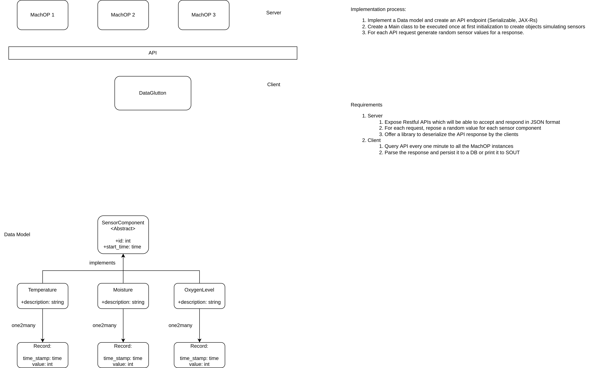

### How to run app using maven

    mvn insatll cargo:run
    

### How to deploy the app using docker-compose

Run the following command from sensor-data repo
     
     docker-compose up
     

### Design and implementation

### List of endpoints exposed

1. http:localhost:8001/sensor-data-server/api/sensor/temperature 
2. http:localhost:8002/sensor-data-server/api/sensor/temperature
3. http:localhost:8003/sensor-data-server/api/sensor/temperature
4. http:localhost:8001/sensor-data-server/api/sensor/oxygen 
5. http:localhost:8002/sensor-data-server/api/sensor/oxygen
6. http:localhost:8003/sensor-data-server/api/sensor/oxygen

Note: It's possible to test endpoint from client app in the client model   
